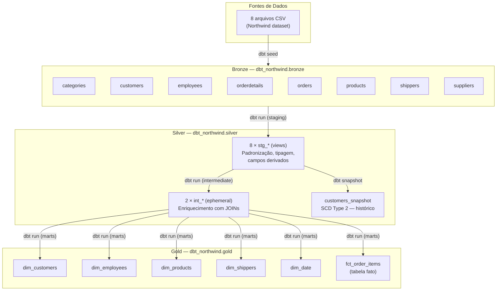
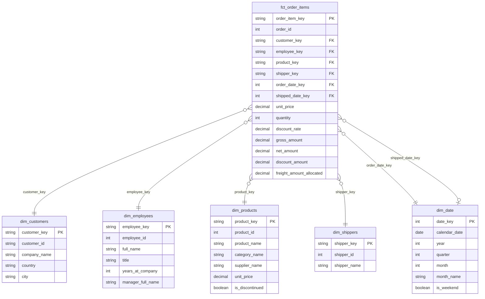
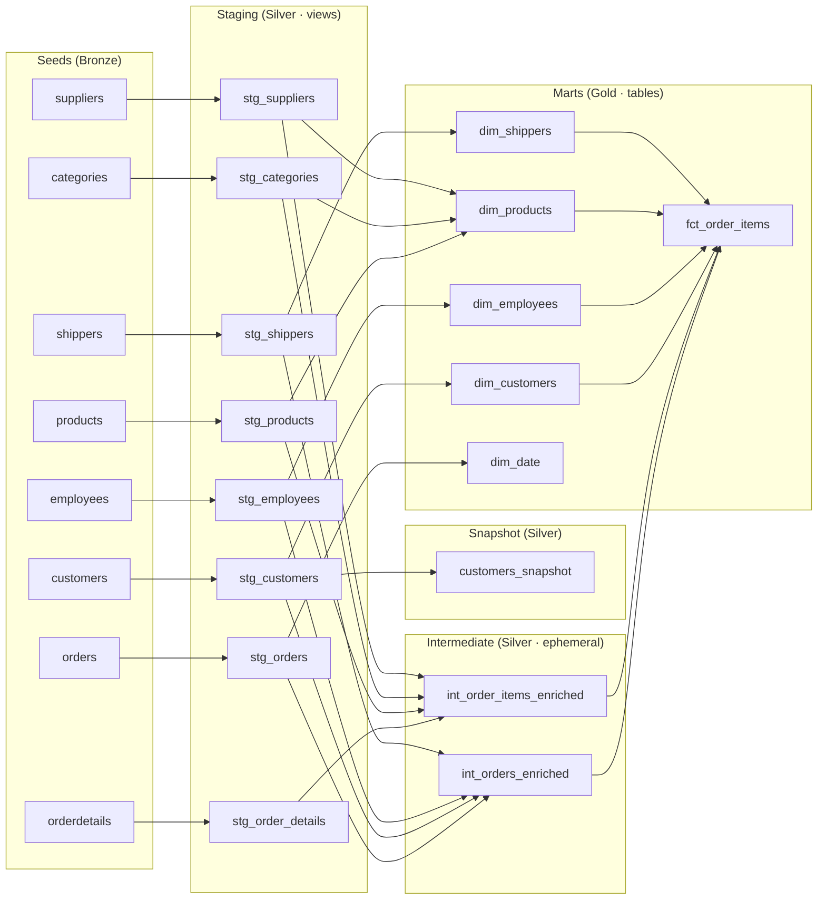
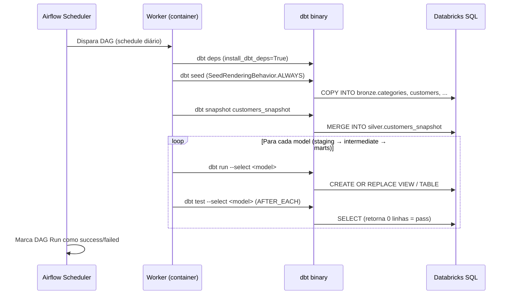
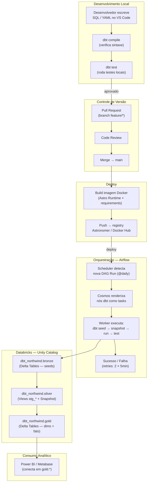

# northwind_dbt

Pipeline de dados analíticos para o dataset Northwind, construído com **dbt + Databricks + Apache Airflow**, seguindo arquitetura Medallion (Bronze → Silver → Gold) e modelagem dimensional (Star Schema).

---

## Sumário

1. [Visão Geral](#visão-geral)
2. [Stack Técnica](#stack-técnica)
3. [Arquitetura do Projeto](#arquitetura-do-projeto)
4. [Estrutura de Diretórios](#estrutura-de-diretórios)
5. [Camada Bronze — Seeds](#camada-bronze--seeds)
6. [Camada Silver — Staging e Intermediate](#camada-silver--staging-e-intermediate)
7. [Camada Gold — Marts](#camada-gold--marts)
8. [Snapshot — SCD Type 2](#snapshot--scd-type-2)
9. [Macros](#macros)
10. [Testes de Qualidade de Dados](#testes-de-qualidade-de-dados)
11. [Databricks e Unity Catalog](#databricks-e-unity-catalog)
12. [Airflow e Orquestração com Cosmos](#airflow-e-orquestração-com-cosmos)
13. [Configuração e Credenciais](#configuração-e-credenciais)
14. [Principais Comandos dbt](#principais-comandos-dbt)
15. [Fluxo Completo do Projeto](#fluxo-completo-do-projeto)

---

## Visão Geral

O **northwind_dbt** transforma os dados brutos do clássico banco de dados Northwind — um sistema de pedidos e inventário fictício — em um modelo dimensional analítico pronto para consumo em ferramentas de BI como Power BI ou Metabase.

O projeto implementa um pipeline completo de engenharia de dados:

- **Ingestão**: 8 arquivos CSV carregados como seeds no Databricks
- **Transformação**: camadas de staging, intermediate e marts com dbt
- **Qualidade**: testes inline (YAML) e testes SQL customizados
- **Histórico**: snapshot SCD Type 2 para rastreamento de mudanças em clientes
- **Orquestração**: DAG Airflow com Astronomer Cosmos, execução diária automatizada

---

## Stack Técnica

| Componente | Versão | Papel neste projeto |
|---|---|---|
| **dbt-core** | 1.12.3 | Engine de transformação SQL; compila e executa os modelos |
| **dbt-databricks** | 1.10.9 | Adapter que conecta dbt ao Databricks SQL Warehouse |
| **dbt-utils** | ≥1.0.0, <2.0.0 | Geração de surrogate keys (`generate_surrogate_key`) |
| **Apache Airflow** | 3.1.5+astro.1 | Orquestrador de workflows; agenda e monitora o pipeline |
| **Astronomer Cosmos** | 1.15.1 | Bridge entre Airflow e dbt; renderiza cada nó dbt como task Airflow |
| **Databricks** | — | Plataforma de computação; executa os SQL via Spark SQL Warehouse |
| **Unity Catalog** | — | Governança de dados; catalog `dbt_northwind` com schemas bronze/silver/gold |
| **Astro Runtime** | 3.1-9 | Imagem Docker base do Airflow (Astronomer) |

---

## Arquitetura do Projeto

### Visão Geral — Arquitetura Medallion



### Modelo Dimensional — Star Schema



### Grafo de Dependências dbt (DAG)



---

## Estrutura de Diretórios

```
airflow_dbt/
├── Dockerfile                        # Imagem Astro Runtime 3.1-9
├── requirements.txt                  # dbt-core, dbt-databricks, astronomer-cosmos
├── dags/
│   └── northwind_dbt_dag.py          # DAG Airflow que orquestra o pipeline dbt
├── include/
│   ├── .dbt/
│   │   └── profiles.yml              # Perfil de conexão ao Databricks
│   └── northwind_dbt/                # Projeto dbt
│       ├── dbt_project.yml           # Configuração central do projeto
│       ├── packages.yml              # Dependências (dbt_utils)
│       ├── package-lock.yml          # Lock file das dependências
│       ├── seeds/
│       │   ├── _sources.yml          # Documentação e tipos dos seeds
│       │   ├── categories.csv
│       │   ├── customers.csv
│       │   ├── employees.csv
│       │   ├── orderdetails.csv
│       │   ├── orders.csv
│       │   ├── products.csv
│       │   ├── shippers.csv
│       │   └── suppliers.csv
│       ├── models/
│       │   ├── staging/
│       │   │   ├── _staging.yml      # Documentação e testes inline
│       │   │   ├── stg_categories.sql
│       │   │   ├── stg_customers.sql
│       │   │   ├── stg_employees.sql
│       │   │   ├── stg_order_details.sql
│       │   │   ├── stg_orders.sql
│       │   │   ├── stg_products.sql
│       │   │   ├── stg_shippers.sql
│       │   │   └── stg_suppliers.sql
│       │   ├── intermediate/
│       │   │   ├── _intermediate.yml
│       │   │   ├── int_orders_enriched.sql
│       │   │   └── int_order_items_enriched.sql
│       │   └── marts/
│       │       ├── _marts.yml        # Documentação, testes e FK constraints
│       │       ├── dim_customers.sql
│       │       ├── dim_date.sql
│       │       ├── dim_employees.sql
│       │       ├── dim_products.sql
│       │       ├── dim_shippers.sql
│       │       └── fct_order_items.sql
│       ├── snapshots/
│       │   └── customers_snapshot.sql # SCD Type 2 — histórico de clientes
│       ├── macros/
│       │   ├── generate_schema_name.sql
│       │   ├── drop_schema.sql
│       │   └── utils.sql
│       ├── tests/
│       │   ├── assert_discount_rate_range.sql
│       │   ├── assert_dim_products_positive_price.sql
│       │   ├── assert_employee_hire_after_birth.sql
│       │   ├── assert_fct_amounts_consistent.sql
│       │   ├── assert_fct_no_orphan_order_id.sql
│       │   ├── assert_fct_no_orphan_product_id.sql
│       │   ├── assert_freight_not_negative.sql
│       │   ├── assert_order_date_before_required_date.sql
│       │   ├── assert_order_date_before_shipped_date.sql
│       │   ├── assert_quantity_positive.sql
│       │   └── assert_unit_price_not_negative.sql
│       ├── analyses/
│       ├── dbt_packages/
│       │   └── dbt_utils/            # Instalado via dbt deps
│       └── logs/
```

---

## Camada Bronze — Seeds

Os **seeds** são a porta de entrada do pipeline. Cada arquivo CSV é carregado como uma tabela Delta no schema `dbt_northwind.bronze` via `dbt seed`.

**Separador**: `;` (ponto e vírgula), definido globalmente em `dbt_project.yml`.

| Seed | Registros aprox. | Descrição |
|---|---|---|
| `categories` | 8 | Categorias de produto (Beverages, Condiments, etc.) |
| `customers` | 91 | Clientes com código alfanumérico de 5 chars (ex: `ALFKI`) |
| `employees` | 9 | Funcionários com hierarquia via `ReportsTo` |
| `orderdetails` | ~2.155 | Itens de pedido — chave composta `OrderID + ProductID` |
| `orders` | ~830 | Cabeçalho dos pedidos com datas e frete |
| `products` | 77 | Produtos com fornecedor, categoria, preço e estoque |
| `shippers` | 3 | Transportadoras (Federal Shipping, Speedy Express, United Package) |
| `suppliers` | 29 | Fornecedores de produtos |

Os tipos de coluna são explicitamente definidos em `seeds/_sources.yml` para garantir tipagem correta no Databricks (ex: `Discount: decimal(5,4)`, `BirthDate: timestamp`).

---

## Camada Silver — Staging e Intermediate

### Staging — 8 views

Cada model de staging lê diretamente de um seed Bronze e executa três operações:

1. **Renomeação** de colunas: `PascalCase → snake_case` (ex: `CustomerID → customer_id`)
2. **Tipagem** explícita: `cast(OrderDate as date)`, conversão de `Discontinued (int) → boolean`
3. **Campos derivados**: colunas calculadas que eliminam lógica repetida nas camadas superiores

Todos os modelos são materializados como **views** — não ocupam storage, são recalculados on demand.

#### Campos derivados relevantes por model

| Model | Campo derivado | Lógica |
|---|---|---|
| `stg_orders` | `shipping_status` | `CASE` sobre `ShippedDate` e `RequiredDate` → `'Pendente' / 'Atrasado' / 'No prazo'` |
| `stg_order_details` | `gross_amount` | `round(UnitPrice * Quantity, 2)` |
| `stg_order_details` | `net_amount` | `round(gross_amount * (1 - discount_rate), 2)` |
| `stg_order_details` | `discount_amount` | `round(gross_amount * discount_rate, 2)` |
| `stg_employees` | `full_name` | `concat(FirstName, ' ', LastName)` |
| `stg_employees` | `reports_to_employee_id` | `nullif(ReportsTo, 0)` — normaliza topo da hierarquia |
| `stg_products` | `is_discontinued` | `CASE WHEN Discontinued = 1 THEN true ELSE false END` |

### Intermediate — 2 models ephemeral

Os models intermediate **não são materializados no Databricks**. Existem apenas em tempo de compilação dbt — são injetados como CTEs dentro dos models de marts que deles dependem.

**Por que ephemeral?** Evita criar objetos intermediários no catalog sem valor analítico direto. O trade-off é que não podem ser consultados diretamente via SQL.

| Model | Propósito |
|---|---|
| `int_orders_enriched` | Enriquece `stg_orders` com nome de cliente (`stg_customers`), nome do funcionário (`stg_employees`) e nome da transportadora (`stg_shippers`) via LEFT JOIN |
| `int_order_items_enriched` | Enriquece `stg_order_details` com nome do produto, categoria e fornecedor via LEFT JOIN em `stg_products`, `stg_categories` e `stg_suppliers` |

---

## Camada Gold — Marts

Todos os models de marts são materializados como **Delta Tables** no schema `dbt_northwind.gold`. São o produto final do pipeline — consumidos diretamente por ferramentas de BI.

### dim_customers

Dimensão de clientes. Representa o **estado atual** de cada cliente.  
O histórico de mudanças é preservado em `silver.customers_snapshot` (SCD Type 2).

- **Surrogate key**: `customer_key` — hash MD5 de `customer_id` via `dbt_utils.generate_surrogate_key`
- **Natural key**: `customer_id` — código alfanumérico de 5 chars (ex: `ALFKI`)

### dim_employees

Dimensão de funcionários com **self-join** para incluir nome e cargo do gerente direto.

- `years_at_company`: calculado dinamicamente com `datediff(current_date(), hire_date) / 365`
- `manager_full_name`: `NULL` para o VP de Vendas (topo da hierarquia)
- `reports_to_employee_id`: `NULL` normalizado via `nullif` no staging

### dim_products

**Dimensão outrigger** — desnormaliza produto + categoria + fornecedor em uma única dimensão.  
Elimina a necessidade de múltiplos JOINs na tabela fato.

Contém atributos de `stg_products`, `stg_categories` e `stg_suppliers` em um único registro por produto.

### dim_shippers

Dimensão simples das 3 transportadoras Northwind: Federal Shipping, Speedy Express e United Package.

### dim_date

Dimensão de data **gerada dinamicamente** a partir do range de datas de `stg_orders`.  
Usa `lateral view posexplode(sequence(...))` — sintaxe nativa Spark SQL para gerar a sequência de datas sem tabela auxiliar.

Atributos incluídos: `year`, `quarter`, `month`, `month_name`, `week_of_year`, `day_of_week`, `is_weekend`, `year_quarter`, `year_month`, `first_day_of_month`, `last_day_of_month`.

### fct_order_items

**Tabela fato central**. Grão: um registro por linha de pedido (`order_id + product_id`).

#### Surrogate keys
Todas as dimensões são referenciadas exclusivamente por surrogate keys (`*_key`). As chaves naturais (`customer_id`, `product_id`, etc.) são removidas da fato — obtíveis via JOIN com as dimensões.

#### Dimensão degenerada
`order_id` é mantido na fato como **dimensão degenerada** — não existe `dim_orders`. O número do pedido identifica a transação sem necessidade de uma tabela separada.

#### Frete rateado
`freight_amount_allocated` é calculado via window function: o frete total do pedido é distribuído proporcionalmente ao valor líquido de cada item:

```sql
round(
    freight_amount * net_amount /
    nullif(sum(net_amount) over (partition by order_id), 0),
    2
) as freight_amount_allocated
```

#### Datas degeneradas
`order_date`, `required_date` e `shipped_date` são mantidos na fato para **conveniência de filtros diretos no BI** sem necessidade de JOIN com `dim_date`. A `dim_date` é usada quando atributos de calendário (trimestre, nome do mês, etc.) são necessários.

#### Métricas disponíveis

| Coluna | Descrição |
|---|---|
| `unit_price` | Preço unitário no momento da venda |
| `quantity` | Quantidade vendida |
| `discount_rate` | Taxa de desconto (0.0 a 1.0) |
| `gross_amount` | Receita bruta (`unit_price × quantity`) |
| `net_amount` | Receita líquida após desconto |
| `discount_amount` | Valor monetário do desconto |
| `freight_amount_allocated` | Frete rateado por item |

---

## Snapshot — SCD Type 2

O snapshot `customers_snapshot` implementa **Slowly Changing Dimension Type 2** para a tabela de clientes.

### Por que SCD Type 2?

Clientes podem alterar endereço, telefone ou contato ao longo do tempo. O SCD Type 2 preserva cada versão histórica, permitindo análises como "qual era o país do cliente no momento do pedido".

### Estratégia: `check`

A tabela de clientes **não possui coluna `updated_at`**. Por isso, utiliza-se a estratégia `check`: a cada execução, dbt computa um hash das colunas monitoradas e detecta qualquer alteração.

**Colunas monitoradas**: `company_name`, `contact_name`, `contact_title`, `address`, `city`, `region`, `postal_code`, `country`, `phone`.

### Campos gerados automaticamente pelo dbt

| Campo | Descrição |
|---|---|
| `dbt_scd_id` | Surrogate key do registro histórico |
| `dbt_updated_at` | Timestamp da detecção da mudança |
| `dbt_valid_from` | Início da validade do registro |
| `dbt_valid_to` | Fim da validade (`NULL` = registro atual) |

### Consultar apenas registros vigentes

```sql
SELECT *
FROM dbt_northwind.silver.customers_snapshot
WHERE dbt_valid_to IS NULL;
```

---

## Macros

### `generate_schema_name` (override)

Sobrescreve o comportamento padrão do dbt que concatena o nome do target com o schema customizado (ex: `dev_gold`). Com esta macro, o schema usado é **exatamente** o definido em `dbt_project.yml`, sem prefixo:

```
bronze  →  dbt_northwind.bronze   (não dev_bronze)
silver  →  dbt_northwind.silver
gold    →  dbt_northwind.gold
```

### `drop_schema`

Macro utilitário para limpeza de schemas em ambientes de CI/CD. Executa `DROP SCHEMA IF EXISTS ... CASCADE` no Databricks.

```bash
dbt run-operation drop_schema --args "{'schema': 'ci_pr_123'}"
```

> **Atenção**: esta macro é destrutiva. Use apenas em ambientes de desenvolvimento ou CI isolados.

### `utils.sql` — 5 macros utilitários

| Macro | Assinatura | Uso |
|---|---|---|
| `cents_to_dollars` | `(column_name)` | Converte centavos → dólares com 2 casas decimais |
| `safe_divide` | `(numerator, denominator)` | Divisão segura — retorna `NULL` quando divisor é 0 |
| `current_timestamp_utc` | `()` | Retorna `current_timestamp()` — metadados de carga |
| `is_current_record` | `(valid_to_column)` | Indicador booleano de registro SCD2 vigente |
| `fiscal_year` | `(date_column, start_month=7)` | Ano fiscal a partir de mês de início configurável |

---

## Testes de Qualidade de Dados

O projeto usa dois tipos de testes dbt:

### Testes Inline (YAML)

Definidos nos arquivos `_staging.yml` e `_marts.yml`. Executam automaticamente via `dbt test`.

**Tipos usados:**
- `unique` — unicidade de chaves primárias
- `not_null` — campos obrigatórios
- `accepted_values` — valores válidos (ex: `shipping_status`)
- `relationships` — integridade referencial entre fato e dimensões

### Testes SQL Customizados (11 arquivos)

Cada arquivo retorna as **linhas que violam a regra** — resultado vazio = teste passa.

| Arquivo | Modelo testado | Regra |
|---|---|---|
| `assert_discount_rate_range` | `stg_order_details` | `discount_rate` deve estar em [0.0, 1.0] |
| `assert_unit_price_not_negative` | `stg_order_details` | `unit_price >= 0` |
| `assert_quantity_positive` | `stg_order_details` | `quantity > 0` |
| `assert_freight_not_negative` | `stg_orders` | `freight_amount >= 0` |
| `assert_order_date_before_required_date` | `stg_orders` | `required_date >= order_date` |
| `assert_order_date_before_shipped_date` | `stg_orders` | `shipped_date >= order_date` (quando não nulo) |
| `assert_employee_hire_after_birth` | `stg_employees` | `hire_date > birth_date` e funcionário com ≥14 anos na contratação |
| `assert_dim_products_positive_price` | `dim_products` | `unit_price`, `units_in_stock`, `units_on_order`, `reorder_level >= 0` |
| `assert_fct_amounts_consistent` | `fct_order_items` | Consistência interna: `gross = price × qty`, `net = gross - discount`, tolerância de R$0,02 |
| `assert_fct_no_orphan_order_id` | `fct_order_items` | Todo `order_id` da fato deve existir em `stg_orders` |
| `assert_fct_no_orphan_product_id` | `fct_order_items` | Todo `product_key` da fato deve existir em `dim_products` |

---

## Databricks e Unity Catalog

### Catalog e Schemas

O projeto usa o catalog `dbt_northwind` com três schemas correspondentes às camadas Medallion:

| Schema | Tipo de objetos | Camada |
|---|---|---|
| `dbt_northwind.bronze` | Delta Tables (seeds) | Ingestão |
| `dbt_northwind.silver` | Views (staging) + Delta Tables (snapshot) | Transformação |
| `dbt_northwind.gold` | Delta Tables (dims + fato) | Consumo analítico |

### Conexão

- **Host**: `dbc-aab5aa5a-ee27.cloud.databricks.com`
- **HTTP Path**: `/sql/1.0/warehouses/d69c53258cb180d5`
- **Tipo**: Databricks SQL Warehouse
- **Threads**: 1 (configurado em `profiles.yml`)

### Compatibilidade Spark SQL

Os modelos usam funções nativas do Spark SQL que **não funcionam em outros adapters** (Snowflake, BigQuery, etc.):

- `lateral view posexplode(sequence(...))` — geração de sequência de datas em `dim_date`
- `date_format(date, 'yyyyMMdd')` — formatação de datas
- `weekofyear()`, `dayofyear()` — funções de calendário
- `datediff(date1, date2)` — diferença em dias (sintaxe invertida vs PostgreSQL)

### Macro `generate_schema_name`

O override desta macro garante que os objetos sejam criados nos schemas exatos (`bronze`, `silver`, `gold`) sem o prefixo do target do dbt (que por padrão seria `dev_bronze`, `dev_silver`, `dev_gold`).

---

## Airflow e Orquestração com Cosmos

### Papel de cada ferramenta

**Apache Airflow** agenda e monitora o pipeline. Ele não executa SQL — delega isso ao dbt.

**Astronomer Cosmos** é o bridge entre Airflow e dbt. Ele lê o manifesto do projeto dbt (`dbt ls`) e **renderiza cada nó dbt como uma task Airflow individual**, incluindo dependências. Isso dá visibilidade granular no Airflow UI: é possível ver o status de cada model, re-executar um único model que falhou, e visualizar o grafo de dependências.

### DAG: `northwind_dbt_dag`

```
Schedule: @daily
Start date: 2025-01-01
Max active runs: 1
Retries: 2 (retry_delay: 5 minutos)
Tags: dbt, databricks, northwind
```

### Configurações Cosmos

| Configuração | Valor | Significado |
|---|---|---|
| `ExecutionMode.LOCAL` | LOCAL | O worker Airflow chama o binário `dbt` diretamente (sem Docker, sem K8s) |
| `LoadMode.DBT_LS` | DBT_LS | Cosmos descobre os nós via `dbt ls` — não precisa de manifesto pré-compilado |
| `TestBehavior.AFTER_EACH` | AFTER_EACH | Os testes de cada model rodam imediatamente após sua materialização |
| `SeedRenderingBehavior.ALWAYS` | ALWAYS | Seeds são executados em toda run (garante dados frescos mesmo que o CSV não mude) |
| `install_dbt_deps=True` | True | `dbt deps` roda automaticamente antes do primeiro model |

### Seleção de nós

```python
select=["path:models", "path:seeds", "path:snapshots"]
```

Inclui todos os tipos de nó: models de staging/intermediate/marts, seeds e snapshots.

### Fluxo de execução no Airflow



### Caminhos no container

```python
DBT_PROJECT_PATH = Path("/usr/local/airflow/include/northwind_dbt")
DBT_PROFILES_DIR = Path("/usr/local/airflow/include/.dbt")
DBT_EXECUTABLE   = Path("/usr/local/bin/dbt")
```

---

## Configuração e Credenciais

### profiles.yml

Localização: `include/.dbt/profiles.yml`

```yaml
northwind_dbt:
  outputs:
    dev:
      type: databricks
      catalog: dbt_northwind
      host: dbc-aab5aa5a-ee27.cloud.databricks.com
      http_path: /sql/1.0/warehouses/d69c53258cb180d5
      schema: dbt          # schema padrão (sobrescrito pela macro generate_schema_name)
      threads: 1
      token: <DATABRICKS_TOKEN>
  target: dev
```

> **Segurança**: o campo `token` contém o Personal Access Token do Databricks. Em produção, substitua pelo valor de uma variável de ambiente ou use um secrets manager (ex: Airflow Connections, AWS Secrets Manager, Databricks Secrets).

### Variáveis do projeto (`dbt_project.yml`)

```yaml
vars:
  northwind_dbt:
    customer_snapshot_strategy: "check"
```

### Dockerfile

```dockerfile
FROM astrocrpublic.azurecr.io/runtime:3.1-9
COPY requirements.txt .
RUN pip install -r requirements.txt
```

### requirements.txt

```
dbt-core
dbt-databricks
astronomer-cosmos
```

> As versões exatas estão fixadas implicitamente pela imagem base Astro Runtime. Para ambientes de produção, recomenda-se pinning explícito de versões.

---

## Principais Comandos dbt

Todos os comandos devem ser executados dentro do diretório `include/northwind_dbt/`.

### Setup

```bash
# Instalar dependências (dbt_utils)
dbt deps

# Verificar conexão com o Databricks
dbt debug
```

### Execução do pipeline

```bash
# Carregar seeds (dados brutos → bronze)
dbt seed

# Executar todos os models (staging + intermediate + marts)
dbt run

# Executar snapshot SCD Type 2
dbt snapshot

# Pipeline completo em ordem correta
dbt seed && dbt snapshot && dbt run
```

### Execução seletiva

```bash
# Executar apenas uma camada
dbt run --select staging
dbt run --select marts

# Executar um model específico e todos os seus descendentes
dbt run --select fct_order_items+

# Executar um model e todos os seus ancestrais
dbt run --select +fct_order_items

# Executar por tag
dbt run --select tag:gold
```

### Testes

```bash
# Executar todos os testes
dbt test

# Executar testes de um model específico
dbt test --select fct_order_items

# Executar apenas testes de uma camada
dbt test --select tag:gold
```

### Documentação

```bash
# Gerar documentação
dbt docs generate

# Servir documentação localmente (http://localhost:8080)
dbt docs serve
```

### Utilitários

```bash
# Listar todos os nós do projeto
dbt ls

# Compilar SQL sem executar
dbt compile --select fct_order_items

# Limpar arquivos compilados
dbt clean

# Dropar schema de CI (macro customizada)
dbt run-operation drop_schema --args "{'schema': 'ci_pr_123'}"
```

---

## Fluxo Completo do Projeto



### Resumo do fluxo por camada

| Etapa | Ferramenta | Entrada | Saída |
|---|---|---|---|
| 1. Ingestão | `dbt seed` | 8 CSVs | `dbt_northwind.bronze.*` (Delta Tables) |
| 2. Snapshot | `dbt snapshot` | `stg_customers` (view) | `dbt_northwind.silver.customers_snapshot` |
| 3. Staging | `dbt run` | Seeds Bronze | `dbt_northwind.silver.stg_*` (views) |
| 4. Intermediate | `dbt run` (ephemeral) | Views Silver | CTEs compiladas (sem objeto no catalog) |
| 5. Marts | `dbt run` | CTEs + Seeds Silver | `dbt_northwind.gold.*` (Delta Tables) |
| 6. Testes | `dbt test` | Todos os modelos | Resultado: pass / fail por model |
| 7. Orquestração | Airflow + Cosmos | DAG schedule diário | Execução automatizada de 1 a 6 |

---

*Documentação gerada com base no código-fonte do projeto. Última atualização: agosto de 2026.*
